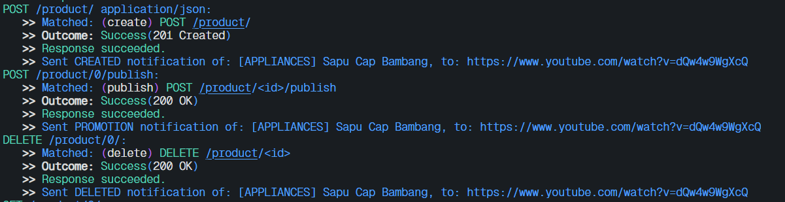

# BambangShop Publisher App
Tutorial and Example for Advanced Programming 2024 - Faculty of Computer Science, Universitas Indonesia

---

## About this Project
In this repository, we have provided you a REST (REpresentational State Transfer) API project using Rocket web framework.

This project consists of four modules:
1.  `controller`: this module contains handler functions used to receive request and send responses.
    In Model-View-Controller (MVC) pattern, this is the Controller part.
2.  `model`: this module contains structs that serve as data containers.
    In MVC pattern, this is the Model part.
3.  `service`: this module contains structs with business logic methods.
    In MVC pattern, this is also the Model part.
4.  `repository`: this module contains structs that serve as databases and methods to access the databases.
    You can use methods of the struct to get list of objects, or operating an object (create, read, update, delete).

This repository provides a basic functionality that makes BambangShop work: ability to create, read, and delete `Product`s.
This repository already contains a functioning `Product` model, repository, service, and controllers that you can try right away.

As this is an Observer Design Pattern tutorial repository, you need to implement another feature: `Notification`.
This feature will notify creation, promotion, and deletion of a product, to external subscribers that are interested of a certain product type.
The subscribers are another Rocket instances, so the notification will be sent using HTTP POST request to each subscriber's `receive notification` address.

## API Documentations

You can download the Postman Collection JSON here: https://ristek.link/AdvProgWeek7Postman

After you download the Postman Collection, you can try the endpoints inside "BambangShop Publisher" folder.
This Postman collection also contains endpoints that you need to implement later on (the `Notification` feature).

Postman is an installable client that you can use to test web endpoints using HTTP request.
You can also make automated functional testing scripts for REST API projects using this client.
You can install Postman via this website: https://www.postman.com/downloads/

## How to Run in Development Environment
1.  Set up environment variables first by creating `.env` file.
    Here is the example of `.env` file:
    ```bash
    APP_INSTANCE_ROOT_URL="http://localhost:8000"
    ```
    Here are the details of each environment variable:
    | variable              | type   | description                                                |
    |-----------------------|--------|------------------------------------------------------------|
    | APP_INSTANCE_ROOT_URL | string | URL address where this publisher instance can be accessed. |
2.  Use `cargo run` to run this app.
    (You might want to use `cargo check` if you only need to verify your work without running the app.)

## Mandatory Checklists (Publisher)
-   [ ] Clone https://gitlab.com/ichlaffterlalu/bambangshop to a new repository.
-   **STAGE 1: Implement models and repositories**
    -   [ ] Commit: `Create Subscriber model struct.`
    -   [ ] Commit: `Create Notification model struct.`
    -   [ ] Commit: `Create Subscriber database and Subscriber repository struct skeleton.`
    -   [ ] Commit: `Implement add function in Subscriber repository.`
    -   [ ] Commit: `Implement list_all function in Subscriber repository.`
    -   [ ] Commit: `Implement delete function in Subscriber repository.`
    -   [ ] Write answers of your learning module's "Reflection Publisher-1" questions in this README.
-   **STAGE 2: Implement services and controllers**
    -   [ ] Commit: `Create Notification service struct skeleton.`
    -   [ ] Commit: `Implement subscribe function in Notification service.`
    -   [ ] Commit: `Implement subscribe function in Notification controller.`
    -   [ ] Commit: `Implement unsubscribe function in Notification service.`
    -   [ ] Commit: `Implement unsubscribe function in Notification controller.`
    -   [ ] Write answers of your learning module's "Reflection Publisher-2" questions in this README.
-   **STAGE 3: Implement notification mechanism**
    -   [ ] Commit: `Implement update method in Subscriber model to send notification HTTP requests.`
    -   [ ] Commit: `Implement notify function in Notification service to notify each Subscriber.`
    -   [ ] Commit: `Implement publish function in Program service and Program controller.`
    -   [ ] Commit: `Edit Product service methods to call notify after create/delete.`
    -   [ ] Write answers of your learning module's "Reflection Publisher-3" questions in this README.

## Your Reflections
This is the place for you to write reflections:

### Mandatory (Publisher) Reflections

#### Reflection Publisher-1

1. Menurut saya untuk kasus projek BambangShop, penggunaan `struct` sudah cukup karena pada projek ini skalanya masih relatif
kecil dan tidak terlalu banyak dependencies terhadap untuk setiap fitur pada projek ini. Namun, menurut saya akan lebih baik menggunaan
`trait` untuk mendefinisikan observer karena terdapat beberapa kelebihan jika kita menggunakan trait seperti:
    - Kode kita menjadi lebih loose coupling
    - Kode kita lebih mudah diextend
    - Memungkinkan untuk membuat banyak jenis observer tanpa harus membuat model yang berbeda untuk setiap jenis observer

2. Penggunaan `Vec` sebenarnya bisa saja tetapi akan membuat kode kita menjadi lebih kompleks dan tidak efisien. Jika kita menggunakan `Vec` maka kita perlu membuat `Vec` yang menyimpan subscriber dan `Vec` yang menyimpan url. Dengan menggunakan `DashMap` kita bisa memetakan subscriber dan url sehingga program menjadi lebih efisien

3. Menurut saya untuk projek ini kita harus menggunakan `DashMap` karena pada projek ini kita menggunakan multi threading sehingga variabel `SUBSCRIBER` akan diakses oleh thread yang berbeda secara bersamaan. Untuk penggunaan pattern Singleton, berdasarkan pemahaman saya pattern Singleton bertujuan untuk memastikan hanya terdapat 1 instance untuk sebuah objek selama aplikasi berjalan. Menurut saya kita tetap dapat menggunakan DashMap dan pattern Singleton secara bersamaan karena keduanya tidak berkaitan.

#### Reflection Publisher-2

1. Berdasarkan pemaham saya, service dan repository harus dipisahkan karena beberapa alasan yaitu separation of concern, kemudahan untuk melakukan scalling, meenghindari kode yang terlalu bloated, decoupling, dan memudahkan saat melakukan testing.

2. Jika kita hanya menggunakan Model maka setiap model akan berisi kode yang mengelola penyimpanan yang berhubungan dengan model tersebut dan model tersebut juga akan berisi business logic yang berhubungan dengan model tersebut. Jika terdapat beberapa model yang harus saling berinteraksi maka hal ini dilakukan dengan melakukan aggregation atau composition. Hal ini akan meningkatkan kompleksitas kode kita dan akan membuat kode kita sulit untuk didebug

3. Menurut saya Postman sangat membantu ketika kita ingin mengetes apakah API yang kita buat sudah mengembalikan data sesuai yang kita inginkan atau tidak. Fitur yang saya sukai dari Postman adalah fitur collection yang membuat pengetesan API kita lebih efisien dan fitur yang dapat menyesuaikan method HTTP yang kita gunakan saat melakukan testing.


#### Reflection Publisher-3
 
1. Pada tutorial ini kita menggunakan variasi Push. Hal ini terlihat dari log di bawah ini yaitu ketika publisher mengirim notifikasi kepada subscriber ketika terjadi perubahan


2. Jika kita menggunakan variasi pull, kelebihannya adalah publisher tidak perlu menyiman instance subscriber karena subscriber sendiri yang akan mengambil data notifikasi tersebut. Kekurangan variasi pull adalah kemungkinan terjadinya misinformasi jika subscriber tidak mengambil data notifikasi

3. Jika kita tidak menggunakan multi threading maka pengiriman notifikasi akan dilakukan secara sequential, hal ini akan berakibat fatal jika jumlah subscribernya sudah terlalu banyak dan subscriber yang berada di urutan terakhir bisa saja menerima notifikasi dengan selisih waktu yang besar dengan subscriber yang berada di urutan pertama
